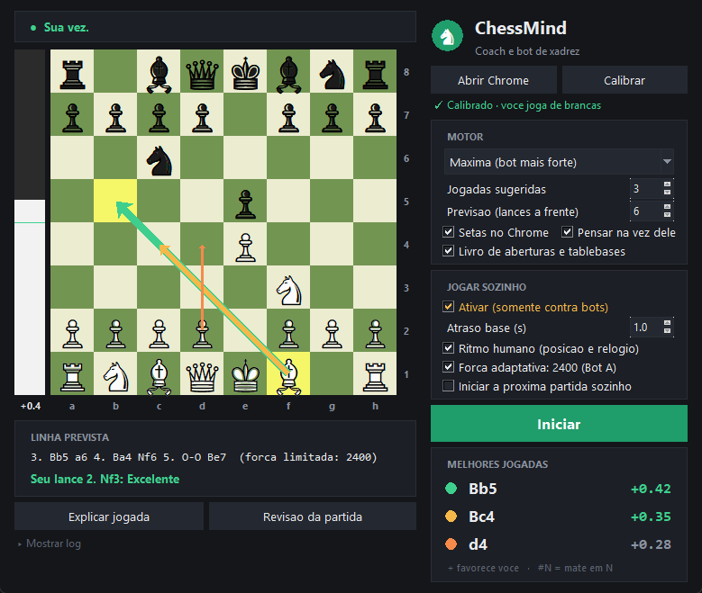
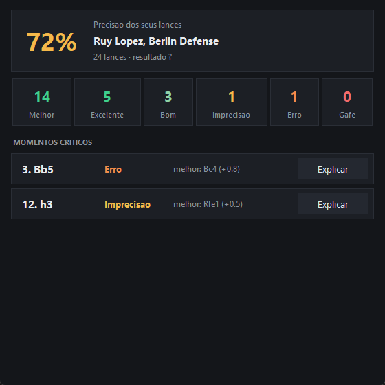
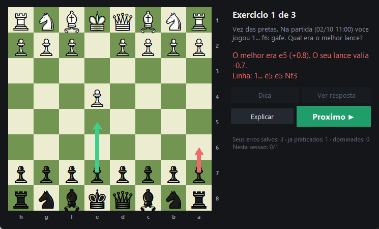
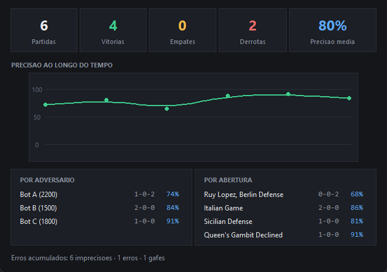
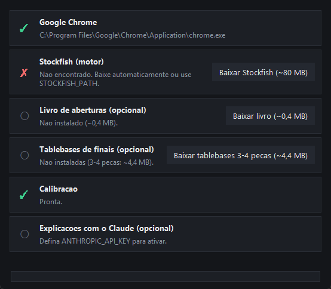
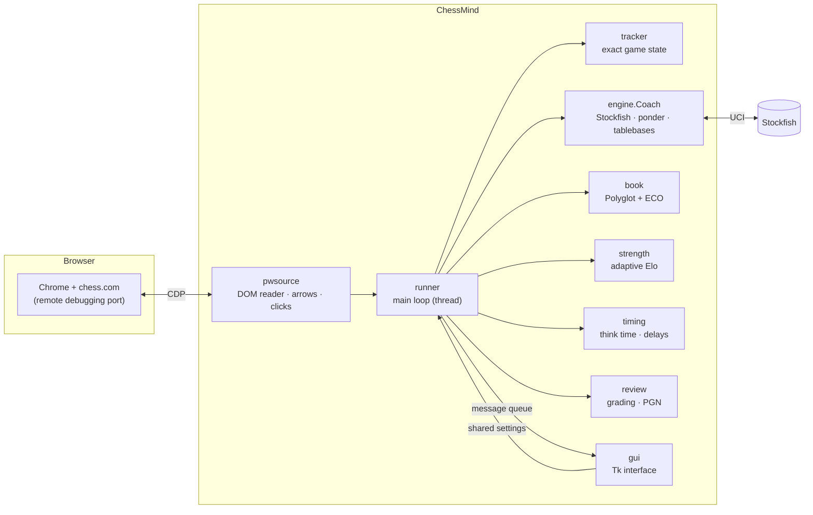

<div align="center">

# ♞ ChessMind

**A real-time chess coach and autonomous bot-player for chess.com, powered by Stockfish and driven through the Chrome DevTools Protocol.**




</div>

---

## Quick start

```text
1. Get the code      git clone https://github.com/theohidekii/chessmind.git      (or Code → Download ZIP, then unzip)
2. Double-click      setup.bat     creates the environment and, if you agree, downloads Stockfish (~80 MB),
                                   an opening book and endgame tablebases
3. Double-click      gui.bat       opens ChessMind
```

You need **Windows 10/11**, **Google Chrome** and **Python 3.11+ with Tk** (installed from [python.org](https://www.python.org/downloads/)).
Nothing else is installed by hand: `setup.bat` finds Python, builds a private environment, and the app itself checks
the installation on launch and offers to download anything that is missing. Details in [Getting started](#getting-started).

## Table of contents

- [Overview](#overview)
- [Highlights](#highlights)
- [Screenshots](#screenshots)
- [How it works](#how-it-works)
- [Architecture](#architecture)
- [Getting started](#getting-started)
- [Using ChessMind](#using-chessmind)
- [Autopilot and adaptive strength](#autopilot-and-adaptive-strength)
- [Safety, fair play and responsible use](#safety-fair-play-and-responsible-use)
- [Configuration](#configuration)
- [Testing](#testing)
- [Design decisions](#design-decisions)
- [Known limitations](#known-limitations)
- [Roadmap](#roadmap)
- [Troubleshooting](#troubleshooting)
- [Contributing](#contributing)
- [License](#license)
- [Acknowledgments](#acknowledgments)

## Overview

ChessMind watches a live game in Chrome, rebuilds the **exact** game state, asks Stockfish for the
best moves and shows them as arrows drawn on the real board. It can also play the moves itself by
clicking the board, **only against chess.com computer opponents**, and it learns from your games
afterwards: every move is graded, mistakes become spaced-repetition exercises, and results feed a
statistics dashboard.

It was built in stages, and each stage is usable on its own:

1. **Coach**: real-time suggestions, a predicted line, an evaluation bar.
2. **Learn**: move grading, post-game review, opening names, training from your own mistakes, statistics, optional natural-language explanations.
3. **Autopilot**: plays by itself against bots, with human-like timing and a strength that adapts to the opponent.

> The user interface is in Brazilian Portuguese. Everything else (code, docs, tests) is in English.

## Highlights

### Reading the game
- **DOM-first board reading** through Playwright over CDP: chess.com piece classes (`wp square-52`) and Lichess piece transforms are parsed exactly, with **zero screenshots** in the hot path (screenshots made the page flicker and added latency).
- **Exact game state** even when joining mid-game: the page's move list is replayed and accepted **only if the resulting board is identical to the board on screen**; otherwise the side to move, castling rights and en passant are inferred from the active clock, the highlighted last move and move legality.
- **Computer-vision fallback** (per-square masks matched against templates learned at calibration) for sites without a DOM reader.

### Thinking
- Stockfish over UCI with **multi-PV**, a predicted principal variation (2 to 12 plies) and an evaluation bar.
- **Multi-reply pondering**: while the opponent thinks, the engine analyses the 3 most likely replies in rotation. If the opponent plays one of them, the answer is ready almost instantly.
- **Opening book** (Polyglot, generated from the Lichess ECO table) with an engine sanity check: a book move is only used if Stockfish rates it within 0.35 pawns of its best move.
- **Syzygy tablebases**: endgames of up to 5 pieces are played perfectly (fastest win, or the longest resistance when losing).

### Playing (autopilot)
- Moves are made by **clicking the squares through CDP** (not by moving the OS mouse), with jitter, and promotion handling.
- **Human-like pacing**: think time depends on the position (forced moves are instant, openings and recaptures are quick, close decisions take longer) and on the clock.
- **Adaptive strength**: starts below the engine's maximum for each opponent and only goes up when you lose.
- A hard **safety guard**: autopilot only runs on computer-opponent pages.

### Learning
- Every move is graded **Best / Excellent / Good / Inaccuracy / Mistake / Blunder** from the change in win probability, with a per-game accuracy score.
- **Post-game review** (PGN and JSON saved to `games/`), recognised openings, critical moments.
- **Training mode**: your own mistakes become exercises on an interactive board, scheduled with Leitner-style spaced repetition; good alternative moves are accepted.
- **Statistics**: accuracy over time, results by opponent and by opening.
- **Optional explanations** from Claude (cached on disk, so the same question never costs twice).

### Engineering
- One worker thread owns the browser and the engine and talks to the GUI through a thread-safe message queue; arrows are an in-page SVG (no native overlay window, no flicker).
- A **single-instance lock**, rotating log files, and a watchdog that clears stale arrows if the engine thread stalls.
- **110 automated tests**, including an end-to-end game simulation against a real headless Chrome and a real Stockfish.

## Screenshots

<table>
  <tr>
    <td align="center"><br><sub><b>Post-game review</b>: accuracy, opening, graded moves, critical moments</sub></td>
    <td align="center"><br><sub><b>Training</b>: your mistakes as exercises (best move in green, yours in red)</sub></td>
  </tr>
  <tr>
    <td align="center"><br><sub><b>Statistics</b>: accuracy trend, results by opponent and by opening</sub></td>
    <td align="center"><br><sub><b>Installation check</b>: what is ready, what is missing, one-click downloads</sub></td>
  </tr>
</table>

> Screenshots are rendered from the real GUI with made-up sample data by [`scripts/make_screenshots.py`](scripts/make_screenshots.py).

## How it works



One iteration of the loop (about every 0.3 s):

1. **Read.** `pwsource` reads the pieces from the page DOM (a cheap `evaluate`, no repaint). The richer page state (move list, clocks, last-move highlight, opponent name, game-over modal) is read only when the position changes or every 1.5 s.
2. **Stabilise.** A position is acted on only after it is read identically twice, so moves in mid-animation are ignored.
3. **Rebuild state.** `tracker` follows legal moves (even two plies between reads). On a resync it replays the move list, validates it against the board and falls back to clock, highlight and legality hints.
4. **Think.** On your turn, `engine.Coach` returns ranked lines. If a tablebase applies it plays perfectly; otherwise the book may suggest a move (verified by the engine). With autopilot on, the move to play is chosen by a strength-limited Stockfish while all displays and grades keep using the **full-strength** analysis.
5. **Show / act.** Arrows are injected into the page as an SVG that expires on its own if the app stops sending heartbeats. With autopilot on, after a human-like delay the move is clicked and then **confirmed on the board** (one retry, then autopilot disables itself).
6. **Opponent's turn.** The engine ponders the 3 likely replies in rotation, so a predicted reply is answered at once.
7. **Learn.** Your move is identified from the board's move stack and graded; at game end the review, the opponent and the result are saved, and the adaptive strength is updated.

### Game state reconstruction

| Priority | Source | Used when |
|---|---|---|
| 1 | Replay of the page's move list | Parseable **and** the replayed board equals the board on screen |
| 2 | Legality filter | Only one side to move leaves the other king un-capturable |
| 3 | Active clock (`clock-player-turn`) | Timed games |
| 4 | Last-move highlight | The piece that just moved reveals the side to move; a double pawn push reveals en passant |
| 5 | Assumption | Last resort: it is your turn, castling inferred from home squares |

### Move grading

Each of your moves is compared with the engine's best line using win probability
(`50 + 50 · (2 / (1 + e^(−0.00368208 · cp)) − 1)`, the Lichess formula):

| Win-probability loss | Grade |
|---|---|
| ≤ 0.5 pts (or the engine's move) | Best |
| ≤ 2 | Excellent |
| ≤ 5 | Good |
| ≤ 10 | Inaccuracy |
| ≤ 20 | Mistake |
| > 20 | Blunder |

## Architecture

```
chessmind/
├── gui.py                  Tk interface: board, suggestions, settings, review / training / stats windows
├── calibrate_pw.py         One-click calibration (learns piece templates for the vision fallback)
├── setup.bat · gui.bat     One-click setup (Python + venv + dependencies + downloads) · launch the app
├── chessmind/
│   ├── pwsource.py         Chrome over CDP: DOM readers, page state, in-page arrows, clicks, safety guard
│   ├── runner.py           Main loop (thread): ties everything together, talks to the GUI via a queue
│   ├── engine.py           Stockfish/UCI: multi-PV, multi-reply pondering, tablebases, limited-strength moves
│   ├── tracker.py          Follows the game and reconstructs exact state (turn, castling, en passant)
│   ├── book.py             Polyglot opening book, ECO table parser/builder
│   ├── timing.py           Think-time budget and human-like move delays
│   ├── strength.py         Adaptive strength manager (per-opponent Elo, persisted)
│   ├── review.py           Move grading, accuracy, game summary, JSON/PGN export, result inference
│   ├── training.py         Exercises from mistakes + spaced repetition + answer checking
│   ├── stats.py            Aggregates saved games (trend, by opponent, by opening)
│   ├── installer.py        Downloads Stockfish, the ECO book and Syzygy tablebases (CLI and GUI share it)
│   ├── setup_check.py      Installation check: what is ready, what is missing, how to fix it
│   ├── explain.py          Optional Claude explanations with an on-disk cache
│   ├── openings.py         Opening names (full ECO table when installed, compact built-in list otherwise)
│   ├── vision.py           Computer-vision fallback: per-square masks + template matching
│   ├── collect.py          Opt-in dataset collector (DOM-labelled squares) for a future learned recogniser
│   └── lock.py · log.py · config.py
├── scripts/
│   ├── get_data.py         Command line for the downloads (Stockfish, ECO book, Syzygy)
│   └── make_screenshots.py Renders the README screenshots from the real GUI
├── tests/                  110 tests (see Testing)
└── docs/images/            Screenshots
```

Runtime data (all git-ignored): `games/` · `logs/` · `training/` (spaced-repetition progress, learned
strength) · `cache/` (explanations) · `dataset/` (collected squares) · `engine/` (Stockfish, books, tablebases).

## Getting started

### Requirements

- **Windows 10/11.** The app uses Windows-specific APIs (process priority flags, `msvcrt` file locking, DPI awareness, capture exclusion).
- **Google Chrome.** The app launches it with a dedicated profile and a debugging port; no browser download is needed.
- **Python 3.11+ with Tk** from [python.org](https://www.python.org/downloads/) (keep *tcl/tk and IDLE* ticked and tick *Add python.exe to PATH*). The project is developed on Python 3.13 and its test suite also passes on 3.14; 3.11 and 3.12 are accepted by `setup.bat` but untested.
- The **Stockfish** engine (GPL-3.0). `setup.bat` and the app can download it for you; it is not bundled.

### Install (two clicks)

1. **Get the code**, either with git or with *Code → Download ZIP* on GitHub (then unzip):

   ```powershell
   git clone https://github.com/theohidekii/chessmind.git
   cd chessmind
   ```

2. **Run `setup.bat`.** It will:
   - find a suitable Python (3.13 first, then 3.14, 3.12, 3.11) and check that Tk is available,
   - create a private virtual environment in `.venv` and install `requirements.txt`,
   - ask whether to download **Stockfish** (the latest official Windows build, ~80 MB), the **opening book** (~0.4 MB) and **3-4 piece tablebases** (~4.4 MB).

   | Command | Behaviour |
   |---|---|
   | `setup.bat` | Asks before downloading |
   | `setup.bat --yes` | Downloads everything without asking |
   | `setup.bat --no-data` | Only builds the environment; get the rest later from inside the app |

3. **Run `gui.bat`** (no console window; startup errors appear in a dialog and in `logs\chessmind.log`). If the environment does not exist yet, it runs `setup.bat` for you.

### Installation check inside the app

On every launch ChessMind checks that **Chrome** and **Stockfish** are present. If Stockfish is missing, it offers to download it
right away. At any time, open **Ferramentas → Verificar instalacao / baixar dados…** to see what is ready and fix it with one click:

| Item | Required | One-click download |
|---|---|---|
| Google Chrome | yes | no (install it yourself) |
| Stockfish | yes | yes, ~80 MB, from the official Stockfish GitHub releases |
| Opening book (Lichess ECO) | no | yes, ~0.4 MB |
| Syzygy tablebases (3-4 pieces) | no | yes, ~4.4 MB |
| Calibration | for running | done from the main window |
| Claude explanations | no | set `ANTHROPIC_API_KEY` |

### Manual alternatives

<details>
<summary>Install by hand, bring your own Stockfish, or use the command line</summary>

```powershell
py -3.13 -m venv .venv
.venv\Scripts\python -m pip install -r requirements.txt
.venv\Scripts\python gui.py
```

> Playwright is used only to *connect* to your installed Chrome, so `playwright install` is **not** required.

**Your own Stockfish.** Put any Stockfish executable at `engine\stockfish.exe` (or `engine\stockfish*\stockfish*.exe`, in a
folder whose name starts with `stockfish`), or point the `STOCKFISH_PATH` environment variable at it.

**Command-line downloads** (the same code the app uses):

```powershell
.venv\Scripts\python scripts\get_data.py --all          # Stockfish + opening book + 3-4 piece tablebases
.venv\Scripts\python scripts\get_data.py --stockfish     # official Stockfish build (~80 MB)
.venv\Scripts\python scripts\get_data.py --eco           # ECO table + opening book (~0.4 MB)
.venv\Scripts\python scripts\get_data.py --syzygy 4      # 3-4 piece tablebases (~4.4 MB)
.venv\Scripts\python scripts\get_data.py --syzygy 5      # 3-5 piece tablebases (~984 MB, 290 files)
```

Files that are already complete are skipped; `--all` does not re-download a Stockfish you already have.

</details>

Without the optional data, ChessMind still works: the book is skipped, openings use a compact built-in list, and
endgames are played by the engine's own search.

### Run

Double-click **`gui.bat`** (or run `.venv\Scripts\python gui.py`).

## Using ChessMind

0. **First launch.** If something required is missing (Chrome or Stockfish), an installation window opens and offers the download.
1. **Open Chrome.** Click **Abrir Chrome**. It opens a dedicated Chrome (separate profile, remote-debugging port 9222). You can play as a guest, or log in inside that profile.
2. **Start a game** at the starting position (for example against a computer opponent on chess.com).
3. **Calibrate.** Click **Calibrar** once. The board and your colour are read from the page; the piece templates (used only by the vision fallback) are learned from the starting position. It should report 32 pieces.
4. **Start.** Click **Iniciar**. On your turn you get ranked moves, arrows on the board (green, yellow, orange for the 1st to 3rd choice), the predicted line and the evaluation bar.
5. **After the game**, open **Revisão da partida**, or use the **Ferramentas** menu for **Treino** (training) and **Estatísticas**.

### Interface reference

| Control | What it does |
|---|---|
| Engine preset (Máxima / Alta / Rápida) | Threads, hash size and think time (4 / 2 / 1 threads) |
| Jogadas sugeridas (1–3) | How many ranked moves to show |
| Previsão (2–12) | Length of the predicted line, in plies |
| Setas no Chrome | Draw arrows on the real board |
| Pensar na vez dele | Ponder the opponent's likely replies |
| Livro de aberturas e tablebases | Use the opening book and Syzygy tables when installed |
| Ativar (somente contra bots) | Autopilot (see below) |
| Ritmo humano | Position- and clock-aware move delays |
| Força adaptativa | Adaptive strength; shows the current level per opponent |
| Iniciar a próxima partida sozinho | Click "New game"/"Rematch" at game end (max 10 in a row) |
| **Ferramentas** menu | Installation check and downloads, training, statistics, last review, open folders, reset learned strength, collect vision data |
| Explicar jogada | Natural-language explanation (needs an API key, see [Configuration](#configuration)) |

## Autopilot and adaptive strength

With **Ativar** on, ChessMind makes the moves itself by clicking the squares through CDP. Autopilot refuses to start unless the page is a
computer-opponent game:

- `chess.com/play/computer…` or `chess.com/game/computer…`, or
- `chess.com/game/<id>` **whose side panel title mentions "bots"** (some bots use this URL; human games do not).

**Adaptive strength** replaces "play at full strength against every bot" with a level that learns each opponent:

| Event | Effect on that opponent's level |
|---|---|
| First game | Starts at *bot rating + 200* (or 2000 if unknown), never at the maximum |
| You lose | +250 |
| Draw | +100 |
| Win | unchanged |
| Position gets bad mid-game (eval ≤ −2.0 for 2 consecutive turns) | +200 immediately (max 2 times per game) |
| Level reaches 3190 | Strength limit is lifted (full engine) |

The level never decreases on its own (reset it from the menu). It is stored per opponent in `training/strength.json`.

**How the limit is applied.** Stockfish's `UCI_Elo` only changes the move chosen by `go`; it does **not** weaken `analyse` output. So ChessMind always analyses at full strength (arrows, grading and timing stay honest) and, only in autopilot, picks the move to play with a strength-limited search. Measured with short games: full-strength Stockfish beats level 1320 by 6–0 and level 2400 by 6–0, and level 2400 beats 1320 by 5.5–0.5.

> Stockfish Elo levels are not the same scale as chess.com bot ratings, which is why the level adapts from results instead of trusting the rating.

## Safety, fair play and responsible use

- **Use ChessMind against computer opponents and for analysis only.** Using an engine during games against people breaks the fair-play rules of chess.com and Lichess and can get accounts banned.
- **Read the Terms of Service.** chess.com's [Fair Play Policy](https://www.chess.com/legal/fair-play) covers games against other people and states that it does not apply to games against its computer bots. Its [User Agreement](https://www.chess.com/legal/user-agreement) (section 4) is a separate matter: it prohibits automation software and automated access, and lets chess.com suspend or terminate accounts with or without cause and without a right of appeal. ChessMind reads the page automatically and, in autopilot, clicks it automatically, so using it on chess.com may breach those terms **even against bots**. This is a risk disclosure, not legal advice, and nothing in the project is designed to hide automation. If that matters to you, ask chess.com support, use a guest session or an account you can afford to lose, or prefer a platform with an official bot API (see the roadmap).
- Autopilot is hard-guarded to computer-opponent pages (see above). The guard is code, not a warning.
- Autopilot disables itself if a move cannot be confirmed on the board, and **Parar** or closing the window stops it immediately.
- **Single instance.** Two copies would fight over the page; the second one refuses to start.
- ChessMind never asks for or stores credentials. The optional API key is read from an environment variable only.
- The dedicated Chrome profile is separate from your everyday browser profile.

## Configuration

Environment variables:

| Variable | Purpose | Default |
|---|---|---|
| `STOCKFISH_PATH` | Path to the Stockfish executable | auto-detected in `engine/` |
| `ANTHROPIC_API_KEY` | Enables Claude explanations (never stored by the app) | unset |
| `CHESSMIND_EXPLAIN_MODEL` | Model used for explanations | `claude-haiku-4-5-20251001` |
| `CHESSMIND_PORT` | Chrome remote-debugging port | `9222` |
| `CHESSMIND_LOG_DIR` | Log directory | `logs/` |
| `CHESSMIND_DEBUG` | Keep the GUI visible to screen capture (used for screenshots) | unset |

Enable explanations once, then restart the app:

```powershell
setx ANTHROPIC_API_KEY "your-key"
```

## Testing

```powershell
.venv\Scripts\python -m pip install -r requirements-dev.txt
.venv\Scripts\python -m pytest tests -q
```

The suite has **110 tests**. Tests that need Stockfish, Chrome or Syzygy tables skip themselves when those are absent: with Stockfish installed 109 run (the Syzygy one needs the tables); on a fresh machine without Stockfish the engine and end-to-end tests are skipped and the rest (92) still run.

| Area | What is covered |
|---|---|
| Tracker | Move following, two-ply gaps, mid-game joins, move-list replay, clock / highlight / legality inference, en passant, castling |
| DOM reading | chess.com and Lichess piece parsing in both orientations, clocks, move lists with figurines, game-over modal, in-page arrows and their self-expiry |
| Engine | Multi-reply pondering (instant answer on a predicted reply, normal calculation otherwise), limited-strength moves (including a real strength-vs-strength game), end-of-game robustness |
| Book and tablebases | Polyglot round-trip, castling encoding, weighted choice, ply limit, engine veto of bad book moves, optimal KQvK conversion |
| Learning | Grading thresholds, review/PGN export, spaced repetition, answer checking, statistics, explanation cache |
| Strength | Start level, increments, per-opponent state, persistence, mid-game bumps |
| Installer | Stockfish asset selection and extraction, engine validation, ECO and tablebase downloads, installation check (all with a simulated network, nothing is downloaded) |
| End-to-end | A full simulated game against a **real headless Chrome and a real Stockfish**: mid-game join, suggestions, arrows, grading, game over, saved review, adaptive strength update |

> The browser tests run against **simulated chess.com/Lichess pages** built from the sites' known structure; they verify the parsing logic, not the live sites.

## Design decisions

- **DOM over pixels.** Reading piece classes is exact, fast and does not repaint the page. Screenshotting the board repeatedly caused visible flicker and misreads (highlights, themes). Vision remains as a fallback.
- **Validate everything you scrape.** A scraped move list is trusted only if replaying it reproduces the on-screen board; every fallback is cheaper to get wrong than a silently illegal suggestion.
- **Arrows live in the page.** A transparent native overlay window flickered the screen on Windows. An injected SVG with a heartbeat-based expiry has no window, no capture problems and cleans up after itself.
- **Analyse at full strength, play at limited strength.** Keeps grading, arrows and timing truthful while the opponent-facing move can be weaker.
- **One writer.** A single-instance lock plus a shared settings dict and a message queue keep the engine thread and the GUI from stepping on each other.
- **Lower engine priority.** Stockfish runs below normal priority so a multi-threaded search never starves the browser.

## Known limitations

- **Windows only** for now.
- chess.com's markup can change. The selectors follow the site's structure at the time of writing and are covered by simulated-page tests; if the real site differs, the move-list reader degrades gracefully to clock/highlight inference and the log tells you what failed.
- Game-over result and opponent name are parsed from page text and are best-effort; unrecognised cases show up as "unknown" in the statistics.
- The Syzygy tablebase test is skipped unless the tables are installed.
- The UI language is Portuguese (pt-BR) only.
- Stockfish Elo and chess.com bot ratings are different scales (hence the adaptive level).

## Roadmap

- English (and other) UI languages.
- A diagnostics button that bundles the page DOM, state and log for bug reports.
- Global emergency hotkey to pause autopilot, and automatic Chrome reconnection.
- Lichess "play vs computer" as a second, stable autopilot target.
- Learned piece recogniser from the opt-in dataset, for any site or theme.
- Linux and macOS support (replace the Windows-specific APIs).
- Packaging (single executable / installer).

## Troubleshooting

| Symptom | Likely cause and fix |
|---|---|
| `setup.bat`: "Python 3.11 or newer with Tk was not found" | Install Python from python.org with *tcl/tk and IDLE* ticked and *Add python.exe to PATH*, then run `setup.bat` again. |
| `setup.bat` fails while installing | Check your internet connection and run it again; it resumes where it stopped. |
| Stockfish not found | Open **Ferramentas → Verificar instalacao** and click the download button, or put the executable in `engine/`, or set `STOCKFISH_PATH`. |
| Window does not open after `gui.bat` | Look at `logs\chessmind.log`; startup errors are also shown in a dialog. |
| "Nenhum tabuleiro na página" | The Chrome tab is not on a game board, or you are not using the Chrome opened by **Abrir Chrome**. |
| Calibration reads ≠ 32 pieces | The game is not at the starting position. Start a new game and calibrate again. |
| Autopilot says it only works against bots | The page failed the computer-opponent guard (see [Autopilot](#autopilot-and-adaptive-strength)). |
| Screen flickers | Make sure only one ChessMind is running; try the *Alta* or *Rápida* preset to lower CPU load. |
| "Já existe outro ChessMind" | Another instance holds the lock; close it (or its leftover Python process). |
| No explanations | Set `ANTHROPIC_API_KEY` and restart; cached explanations work without a key. |

Logs are written to `logs/chessmind.log` (rotating). The **Ferramentas** menu opens the log and games folders.

## Contributing

Issues and pull requests are welcome. Before opening a PR:

```powershell
.venv\Scripts\python -m pytest tests -q
```

Please keep new behaviour covered by tests (the DOM and engine layers have fixtures you can extend), and
prefer small, focused changes.

## License

Released under the **GNU General Public License v3.0**, see [LICENSE](LICENSE). The GPL is required
because ChessMind builds on [python-chess](https://github.com/niklasf/python-chess) (GPL-3.0) and is
designed to run with [Stockfish](https://stockfishchess.org/) (GPL-3.0). Stockfish is **not** bundled;
you download it separately.

Copyright © 2026 Theo Hideki.

## Acknowledgments

- [Stockfish](https://stockfishchess.org/): the chess engine.
- [python-chess](https://github.com/niklasf/python-chess): move generation, UCI, Polyglot and Syzygy support.
- [Playwright](https://playwright.dev/): browser automation over the DevTools Protocol.
- [Lichess](https://lichess.org/): the ECO openings dataset ([chess-openings](https://github.com/lichess-org/chess-openings), CC0), Syzygy tablebase hosting, and the win-probability and accuracy formulas.
- [OpenCV](https://opencv.org/) and [NumPy](https://numpy.org/): the vision fallback.
- [Anthropic](https://www.anthropic.com/): optional natural-language explanations.

ChessMind is an independent project and is not affiliated with or endorsed by chess.com, Lichess, Stockfish, Google or Anthropic.
